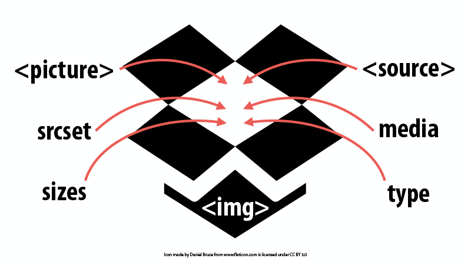
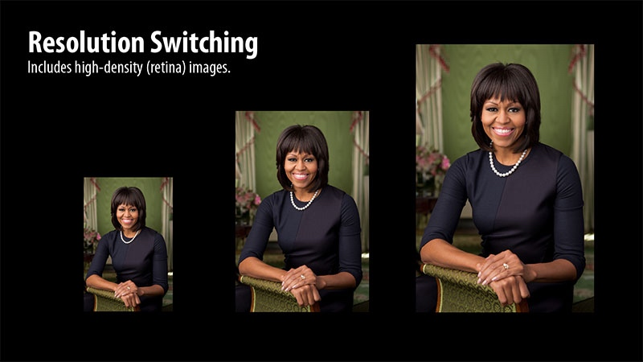
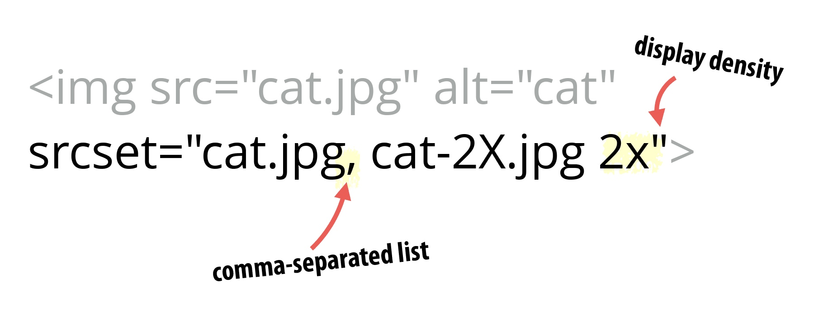
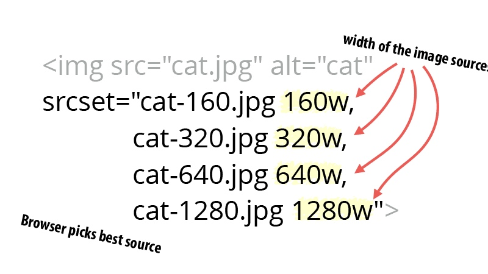
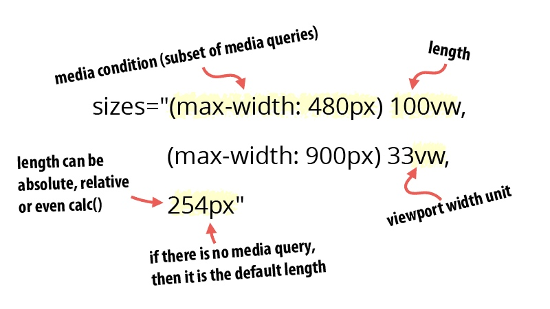
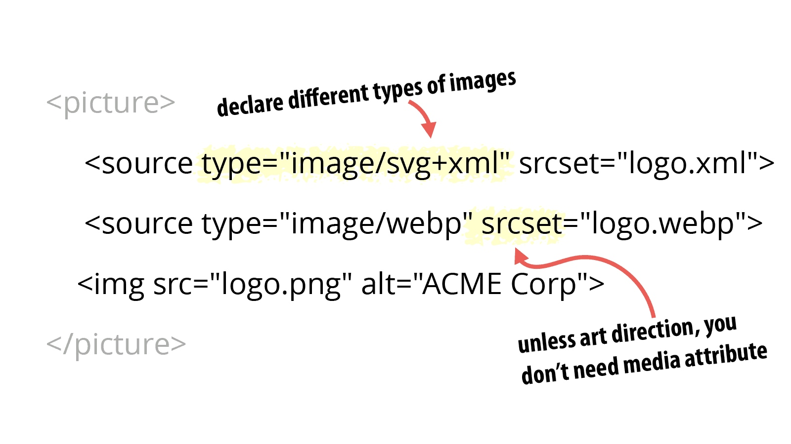
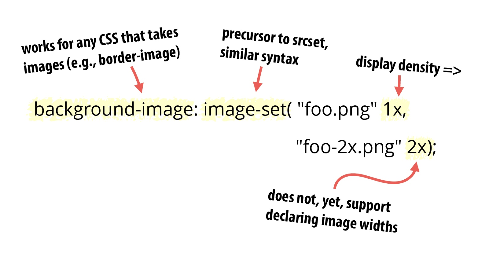
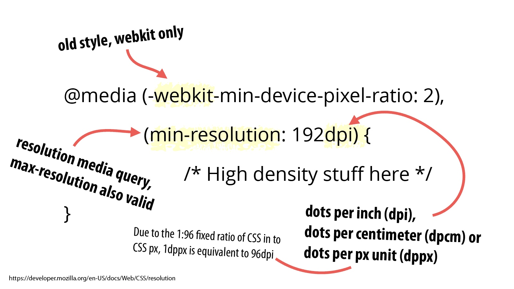
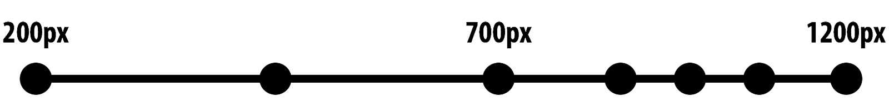

# Purpose

high-res devices can get the optimum image for a given resolution, while low-resolution devices can avoid wasting time and bandwidth downloading overly-large files.

img
- fixed width, single density web page
- small difference in file size
- SVG, vector-based image



# Use Case: Resolution Switch

Resolution switching is the most common use case. It refers to any scenario where you all you want to do is provide different sizes of an image and you’re not making any modifications to the content or aspect ratio of the image.



## Attribute: srcset

### Display Density Descriptors



### Width Descriptors




## Attribute: sizes

image begin downloading before CSS and JS files downloaded completely, so browser only get viewport at that time



### Media Condition

`@media screen` can not used

mostly
`(max-width: 480px)` and `(min-width: 480px)`

### Lengths

vw = viewport width

100vw = 100% viewport width

support absolute and relative length, even CSS calc()

### Make browser be smart

until now, what we done, give more attribute to ``, is a suggestion to browser, and then make it be smarter to choose better image size


# Use Case: Art Direction

image have gravity, when saw in small screen device, not whole image resize, just crop the meaningful part from image.

[Image Current Src Demo](https://cloudfour.com/examples/img-currentsrc/)


```html
<picture>
  <source srcset="homepage-person@desktop.png, homepage-person@desktop-2x.png 2x"       
          media="(min-width: 990px)">
  <source srcset="homepage-person@tablet.png, homepage-person@tablet-2x.png 2x" 
          media="(min-width: 750px)">
  
</picture>
```

here, `media` attribute is a directive to browser rather than a suggestion.

## Attribute: type

The browser will pick the first source where the declared image type is one that it supports. If it doesn’t recognize any of the source types, it will use the  element’s src or srcset declarations.



# Conclusions

- Most images on the web fit the resolution switching use case.
- When you’ve got a resolution switching use case, you want to empower the browser to make the best choice possible. This is what srcset is designed to do.
- When you use the <picture> element with media attributes, you’re dictating to the browser what images it should use.
- Therefore, you can and should use <picture> when you want both resolution switching and to support multiple image formats. Just leave off the media attribute so that the browser can do its thing.

# Other stuff

## img fallback of SVG

```

```

## picture of SVG

```
<picture>
    <source type="image/svg+xml" srcset="path/to/logo.svg">
    
</picture>
```

# Responsive image in CSS

# image-set



# Media query




# Break points



Instead of spacing out breakpoints evenly, we should have more breakpoints as the image gets larger.

# Processing Responsive Image

- Where possible, use resolution independent SVG images.
- When creating or modifying the design of templates, the template author provides the sizes attribute for the various images in the template.
- The srcset attribute with width descriptors is inserted by the server which does all of the heavy lifting of figuring out what image breakpoints to choose for each image.
- Content authors never worry about any of this. Their only responsibility is to upload the highest quality source available and let the image resizing service take care of the rest.

# Resources

- **[Responsive Images 101](https://cloudfour.com/thinks/responsive-images-101-definitions/)**
- **[lazysizes](https://github.com/aFarkas/lazysizes)**
- **[native responsive image](https://dev.opera.com/articles/native-responsive-images/)**
- [image-rendering CSS property](https://developer.mozilla.org/en-US/docs/Web/CSS/image-rendering)
- [Iphone 6P downsampling](https://www.paintcodeapp.com/news/iphone-6-screens-demystified)
- [Better SVG Fallback and Art Direction With The <picture> Element](https://sarasoueidan.com/blog/svg-picture/)
- [BreakingPoint Generator](http://www.responsivebreakpoints.com/)
- [Window.devicePixelRatio](http://caniuse.com/#feat=devicepixelratio)
- [Cloudinary Image Transformation reference](http://cloudinary.com/documentation/image_transformation_reference)
- [Cloudinary BreakingPoint Generator](http://cloudinary.com/documentation/responsive_images)


