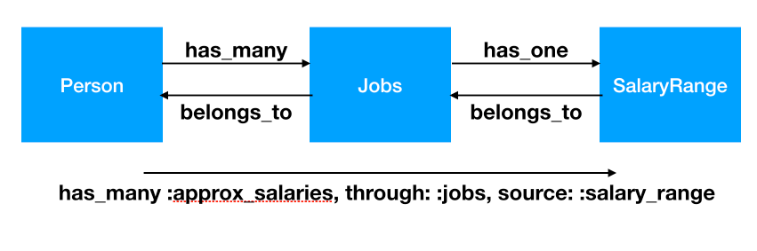

# Assumption

1. Person

```
rails g model person first_name last_name age:integer
```

# One-to-One


```
rails g model personal_info height:float weight:float person:references
```

- One person has exactly `one` personal_info entry
- One personal_info entry `belongs` to exactly one person
- The ***belongs to*** side is the one with a `foreign key`

**Convention**: Default name for the foreign key is `#{master_table_singular}_id`, e.g. person_id

## Relationship in model

```ruby
# person.rb
class PersonalInfo < ActiveRecord::Base
  belongs_to :person
end

# personal_info.rb
class Person < ActiveRecord::Base
  has_one :personal_info
end
```

## Options

### Orphaned associations - dependent

1. `:delete` - remove associated object(s) by issuing a query
2. `:destroy` - same as above, but remove the association by calling `destroy` on it
3. `:nullify` - set the foreign key to NULL (leave the associated entity alone - just disassociate)

```ruby
# person.rb
class Person < ActiveRecord::Base
  has_one :personal_info, dependent: :destroy
end
```

## Helper methods

```
rails c

p = Person.find_by first_name: "John"

p.personal_info
=> nil
```

two way to new personal info for "John"
- create_personal_info
- build_personal_info

```
p.create_personal_info height: 170.1, weight: 70.5
```

```
p.build_personal_info height: 170.1, weight: 70.5
p.save
```

## Brief

- `has_one`
- `belongs_to`
- `create_personal_info`
- `build_personal_info`


# One-to-Many


```
rails g model job title company position_id person:references
```

- One person `has one or more` jobs
- One job entry `belongs to` exactly one person
- The `belongs to` side is the one with a foreign key

**Convention**: Default name for the foreign key is `#{master_table_singular}_id`, e.g. person_id

## Relationship in model

```ruby
# person.rb
class Person < ActiveRecord::Base
  has_one :personal_info
  has_many :jobs
end

# job.rb
class Job < ActiveRecord::Base
  belongs_to :person
end
```

## Options

### class_name

```ruby
# person.rb
class Person < ActiveRecord::Base
  has_one :personal_info
  has_many :jobs
  has_many :my_jobs, class_name: "Job"
end
```

alias the name and point out the model name

### Orphaned associations - dependent

1. `:delete` - remove associated object(s) by issuing a query
2. `:destroy` - same as above, but remove the association by calling `destroy` on it
3. `:nullify` - set the foreign key to NULL (leave the associated entity alone - just disassociate)

```ruby
# person.rb
class Person < ActiveRecord::Base
  has_one :personal_info
  has_many :jobs, dependent: :destroy
end
```

## Helper methods

### <<

```
rails c

Job.create company: "MS", title: "Developer", position_id: "#1234"
p1 = Person.first
p1.jobs
=> nil

p1.jobs << Job.first

Job.first.person
=> #<Person ...
```

### clear

```
p1.jobs.clear
```

disassociates jobs from this person by setting foreign key to NULL

### create and where scoped to person!

```
p1.jobs.create [
  { title: "dev", company: "MS", position_id: "#123123" }
]
```

```
p1.jobs.where(company: "MS").count
```

remember it is also helpful in migrations

```
Person.first.create! [
]
```

## Brief

- `has_many`
- `belongs_to`
- `dependent`
- `clear`
- `create`
- `where`


# Many-to-Many


- One person can `have many` hobbies
- One hobby can be `shared by many` people
- `habtm` (has_and_belongs_to_many)

Need to create an extra (a.k.a join) table (without a model, i.e. just a migration)

**Convention**: ***Plural*** model names separated by an underscore in ***alphabetical*** order


```
rails g model hobby name
rails g migration create_hobbies_people person:references hobby:references
```

Hobbies_People <- plural && alphabetical order

## Migration - join table

The Many-to-Many associated with **2** model and **3** migrations

```ruby
class CreateHobbiesPeople < ActiveRecord::Migration
  def change
    create_table :hobbies_people, id: false do |t|
      t.references :person, index: true, foreign_key: true
      t.references :hobby, index: true, foreign_key: true
    end
  end
end

```

Since we don't need primary id in join tables, so set `id: false`


## Relationship in model


```ruby
# person.rb
class Person < ActiveRecord::Base
  has_one :personal_info
  has_many :jobs
  has_and_belongs_to_many :hobbies
end


# hobby.rb
class Hobby < ActiveRecord::Base
  has_and_belongs_to_many :people
end

```

## Helper method

```
rails c

josh = Person.find_by first_name: "Josh"
=> #<Person ...

lebron = Person.find_by first_name: "Lebron"
=> #<Person ...

programming = Hobby.create name: "Programming"
=> #<Hobby ...

josh.hobbies << programming; lebron.hobbies << programming

programming.people
=> # ... Collection [ ... josh and lebron ... ]
```

## Brief

- `has_and_belongs_to`
- 2 model and 3 migrations, join table only exists in the DB, but not in Ruby code


# Rich Many-to-Many




- keep some data on the join table
- `grandchild` relationship on a model, user -> articles -> comments
- in our case, all salary ranges for a particular person

## Basic Idea

you first `create` and `regular` parent-child relationship and then `use the child model as a join` between the parent and grandchild

```
rails g model salary_range min_salary:float max_salary:float job:references

rake db:migrate
```

## Relationship in model

```ruby
# job.rb
class Job < ActiveRecord::Base
  belongs_to :person
  has_one :salary_range
end

# salary_range.rb
class SalaryRange < ActiveRecord::Base
  belongs_to :job
end
```

`person` is grandparent to `salary_range`

```ruby
# person.rb
class Person < ActiveRecord::Base
  has_one :personal_info
  has_many :jobs
  has_and_belongs_to_many :hobbies
  has_many :approx_salary, through: :jobs, source: :salary_range
end
```

## Helper methods

```
rails c

lebron = Person.find_by(first_name: "LeBron")
=> #<Person ...

lebron.jobs.count
=> 2

lebron.jobs.pluck(:id)
=> [12, 13]

Job.find(12).create_salary_range(min_salary: 10000.00, max_salary: 20000.00)
=> #<SalaryRange id: 1 ...

Job.find(13).create_salary_range(min_salary: 15000.00, max_salary: 35000.00)
=> #<SalaryRange id: 2 ...

lebron.approx_salaries
=> ... Collection ... [ #<SalaryRange id: 1 ... , #<SalaryRange id: 2 ... ]

```


### Calculations


```ruby
class Person < ActiveRecord::Base
  has_one :personal_info
  has_many :jobs
  has_and_belongs_to_many :hobbies
  has_many :approx_salaries, through: :jobs, source: :salary_range

  def max_salary
    approx_salaries.maximum(:max_salary)
  end
end
```

```
rails c

lebron = Person.find_by first_name: "Lebron"

lebron.max_salary
=> 350000.00
```

More infos on [http://api.rubyonrails.org/classes/ActiveRecord/Calculations.html](http://api.rubyonrails.org/classes/ActiveRecord/Calculations.html)

# Brief

- `though`
- `source`

