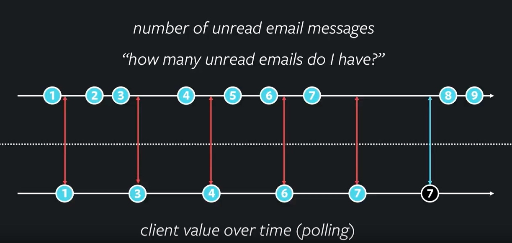
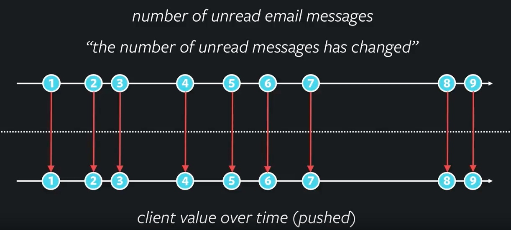
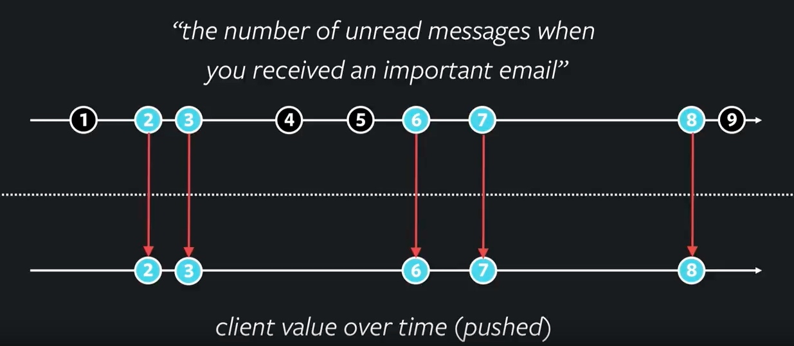

# Classic Use Case

Building a email App, email message, unreadCount is needed.

## Polling



+ simple
+ initiative
- sometimes get no useful infos 

## Pushed

- live query
- subscription

live query: when sth changed in back-end should be push to client

subscription: client get pushed data should know why they are pushed



back-end challenge and scale




only push when important emails


# Why GraphQL is used

client subscribe a client, when the event triggered. What infos should be send to client.

## Minimum

only changed thing

```
{
    "id": "https://api.com/1234"
}
```

## Fixed

same exact data to every subscriber

```
{
    "id": 1234,
    "name": "Luker Skywalker",
    "status": "missing",
    "bio": "Son of Anakin...",
    "fatherId": 842,
}
```

works well when public valuable data, but extra info to subscriber. (i.e. bio is not used in mobile app)

## Subscriber Variant

individual data send to subscriber.
everyone should be customized

```
{
    "unreadCount": 35
}
```

# GraphQL Usage

## wish driven design

following data JSON is wanted

```
{
    "emails": [{
        "from": "carl@gmail.com",
        "subject": "hey",
        "isRead": false,
    }]
}
```

in GraphQL, is a query

```
query {
    emails {
        from
        subject
        isRead
    }
}
```

no more, no less

## GraphQL Subscription

```
subscription {
    importantEmail {
        from
        subject
        isRead
    }
}
```

# Resource

- [React Conf 2017](https://www.youtube.com/watch?v=AYbVMNtO-ro)

