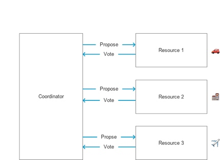
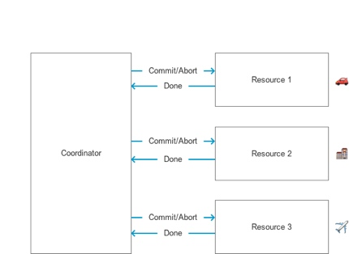
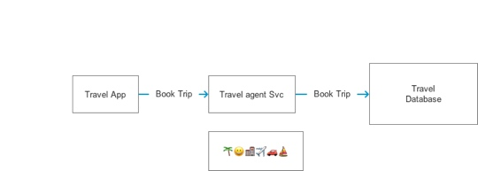
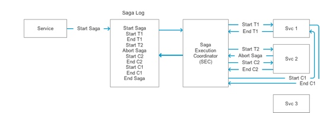

# Simple System with SQL Database

First, we have a travel app, user want to book a trip. Backend is with a single giant database.

# System with SOA/Microservices

SOA(Server-Oriented Architecture)

Now, we separate from a single transaction to several micro services. We can **NOT** have transaction any more.

Here is the question, how to guarantee Atomicity in database?

# Solution of Atomicity

## Two Phase Commit

- Prepare Phase
- Commit Phase

as the name pointed out, there is two phase in commit action to database.

### Prepare Phase

In this step,  
Coordinator request each resource, resource will vote as feedback, such as passed unanimously, or veto.

### Commit Phase

If everyone say 'yes', then we go to this step, Coordinator commit the actions, like booking car, hotel and flight. 

### 2PC Doesn't Scale

- O(n^2 ) Messages
- Coordinator: Single Point Of Failure
- Reduced Throughout

First, every successful 2PC need O(n^2) message, which is not a high performance thing. Second, if Coordinate crashed, it's hard to figure out safe state, or rollback. Third, we can not get a full bandwidth throughout, which is another poor performance thing.

## Google Spanner

Spanner is Google's globally-distributed database.

Spanner is Google's scalable, multi-version, **globally distributed**, and synchronously-replicated database. It's the first system to distribute data at global scale and support externally-consistent **distributed transactions**.

The key enabler of these properties is a new **True Time** API and its implementation...using multiple modern clock references**(GPS and atomic clocks)**.

### Spanner is Expensive & Proprietary

- Custom Hardware & Data-Centers
- Synchronization Not Solved

## Saga

Hector Garcia-Molina, Kenneth Salem from Princeton University 1987

### What is Saga?

Sagas are Long Lived Transactions that can be written as a sequence of transactions that can be interleaved.

All transactions in the sequence complete successfully or compensating transactions are ran to amend a partial execution.

A Saga is a collection of sub-transactions. T1, T2, ..., Tn

Each sub-transaction has a compensating transaction. C1, C2, ..., Cn

Cn semantically undoes Tn.

### Saga Guarantee

Either
- T1, T2, ..., Tn
- T1, T2, ..., Tj, Cj, ..., C2, C1

It's a tradeoff atomicity for availability. Pieces of Saga composes of a long lived transaction.

### Saga are Failure Management Pattern

We need to plan everything when fail, especially in the cloud, or other network you don't own. Things are not always applied in your design pattern. We all should to think about what if things go off the golden path.

### Using Saga in System

recap the simple system with single database

Now, This is where saga comes in.

#### Saga Execution Coordinator (SEC)

This part is to go and execute sub-request, and in some condition, execute compensating transactions

#### Saga Log

#### Successful Saga

- Begin Saga
- Start Book Hotel (T1)
- End Book Hotel (T1)
- Start Book Car Rental (T2)
- End Book Car Rental (T2)
- Start Book Flight (T3)
- End Book Flight (T3)
- End Saga

Success! beautiful world 😊

#### Unsuccessful Saga

intro to `backwards recovery`, which is most common and used.

- Begin Saga
- Start Book Hotel (T1)
- End Book Hotel (T1)
- Start Book Car Rental (T2)
- Abort Saga
- Start Compensate Car Rental (C2)
- End Compensate Car Rental (C2)
- Start Compensate Hotel (C1)
- End Compensate Hotel (C1)
- End Saga

a truly failure management pattern 👌🏼

### Using Saga in Distributed System

remember, we now have microservices!

So, we can **NOT** have transaction now, we get sub-request instead. Or, we can say, trade atomicity for avalibility.

A distributed Saga is a collection of sub-requests T1, T2, ..., Tn.

Each Sub-request has a compensating request C1, C2, ..., Cn.

So far so good.

#### Successful Saga

- Begin Saga
- Start Book Hotel (T1)
- End Book Hotel (T1)
- Start Book Car Rental (T2)
- End Book Car Rental (T2)
- Start Book Flight (T3)
- End Book Flight (T3)
- End Saga

Even in distributed system, the successful saga is still same, but now, we need to consider the durable. This is where Saga Execution Coordinator (SEC) comes in

#### Saga Execution Coordinator (SEC)

- Interprets & Writes a Saga log
- Applies Saga Sub-Requests
- Applies Saga Compensating Requests when Necessary

Now, we walk through the commit in distributed system with saga pattern

#### Unsuccessful Saga

Apply Compensating Requests

- Aborted Saga Response
- Start Request Fails
- SEC Crashes (non-safe state)

Response by server like can not do this, server unavailable, you don't have access.

HTTP fail, timeout.

SEC is the execution commander, if it failed in non-safe state, we should apply compensate requests.

This is the failure case. This just like rollback to previous state.

#### Failure Thinking 

1.Question: What happens when compensating requests fail?

Answer: `idempotent`, we can retry the compensating request with no worry about state.

2.Question: What happens when SEC fails?

Answer: check the state is safe or non-safe, apply compensating requests in non-safe state.

safe state:

- All executed sub-requests are complete (Start T1 & End T1 both logged)
- Saga has been aborted, processed with compensating transactions

If a complete success or failure log, it's in safe state

non-safe state:

- Start Ti logged, no End Ti logged

telling SEC crashed in middle of long live transaction.

In this case, abort saga, and start compensating requests.

#### Request Messaging Semantics

- Sub-Requests (Ti): At Most Once
- Compensating Requests (Ci): At Least Once

Distributed Saga Guarantee

Either
- T1, T2, ..., Tn or
- T1, T2, ..., Ti, Ci, ..., C2, C1

#### Forward-Recovery

In backward-recovery, if one sub-request failed, SEC will apply compensating request to rollback system to a safe state.

In contrast, forward-recovery, if one sub-request failed, it just retry sometimes later.

With this, we need to ensure sub-requests must also be `idempotent` just like compensate requests in backward recovery.

# Saga Pattern

As you can see, we call this Saga Pattern. You can make tradeoffs in your own system. Building general distributed saga system, or building one can work for your system. This is totally valid. It's the pattern for you to use to make sure the system is correct.

# Resources

- [GOTO 2015 Applying the Saga Pattern](https://www.youtube.com/watch?v=xDuwrtwYHu8) By Caitie McCaffrey
- [Original paper](http://www.cs.cornell.edu/andru/cs711/2002fa/reading/sagas.pdf) By Hector Garcia-Molina & Kenneth Salem

