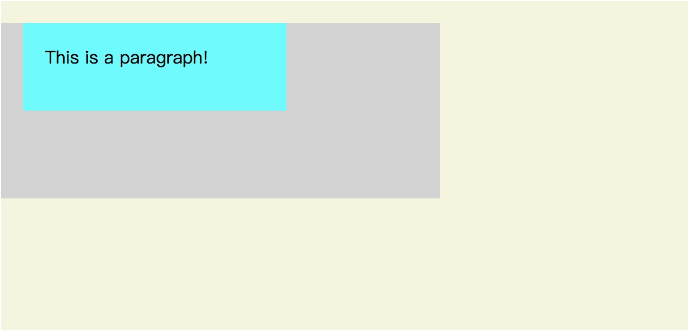
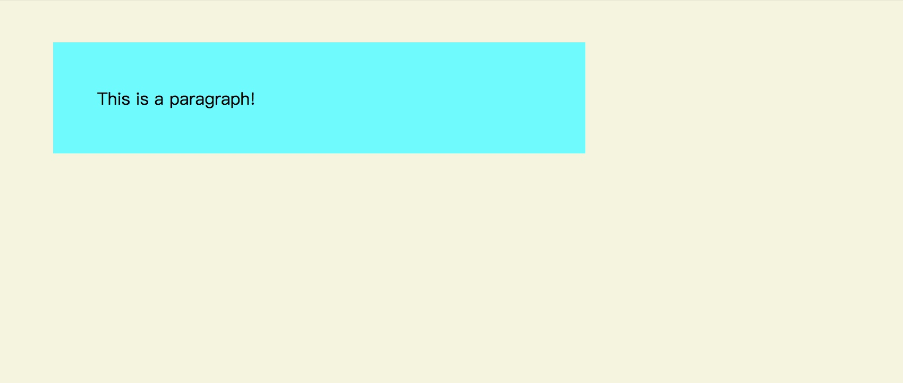
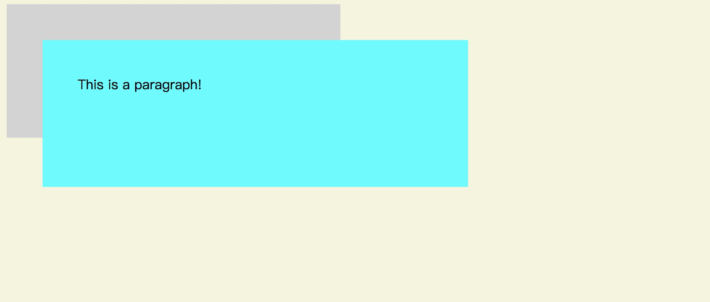
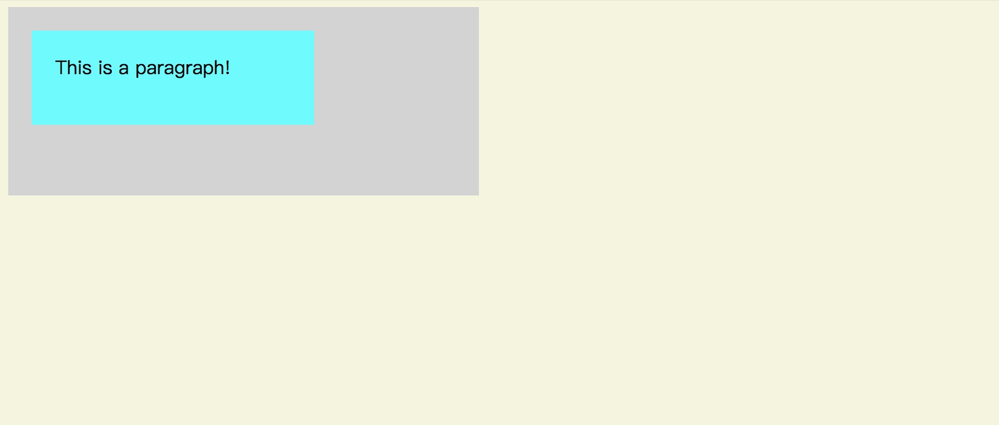

# position

我们都知道元素都拥有 `position` 这个css属性，先来看看他的基本定义和可用值。

## 定义

  `position` 决定了元素位置是如何被渲染的

## 可用值

| 值       | 描述                                        |
| ---      | ---                                         |
| static   | 默认值，元素在文档流中依次渲染              |
| absolute | 元素位置相对于其最近的非 static 的父元素    |
| fixed    | 元素位置相对于浏览器窗口                    |
| relative | 元素位置相对于原本应该渲染的位置            |
| sticky   | 根据滚动的位置在 relative 和 fixed 之间切换 |
| initial  | 设置为默认值                                |
| inherit  | 从父元素继承                                |

## 基本用法


```html
<body>
  <section>
    <p>This is a paragraph!</p>
  </section>
</body>
```

```css
body {
  background: beige;
}

section {
  display: block;
  width: 400px;
  height: 160px;
  background: lightgray;
}

p {
  width: 50%;   /* == 400px * .5 = 200px */
  height: 25%;  /* == 160px * .25 = 40px */
  margin: 5%;   /* == 400px * .05 = 20px */
  padding: 5%;  /* == 400px * .05 = 20px */
  background: cyan;
}
```



很好，与我们期望的一样渲染出来了。现在我们把 `section` 的 `display` 属性 换成 `inline`

```css
section {
  display: inline;
  width: 400px;
  height: 160px;
  background: lightgray;
}
```



这个破坏真是立竿见影啊，为什么会这样呢？要知晓其中的奥秘，就要了解什么是内容块。

# 内容块

## 定义

通常情况下，元素的大小和位置都取决他的内容块。一般地，内容块是该元素最近的块级父元素，但有一些例外情况。

## 为什么内容块很重要

元素的大小和位置都是由其内容块做为参考的，他会影响到元素的 `width`, `height`, `padding`, `margin` 还有 `offset` 相关的属性。

## 如何找到元素对应的内容块

1. `position` 是 `static` 或者 `relative` 时，其内容块是其最近的块级父元素的内容框(content-box)，比如 `block`, `inline-block`, `list-item`，或者是被指定为某种格式容器的元素，比如 `table`, `flex`, `grid`。
2. `position` 是 `absolute` 时，其内容块是其最近的 `position` 不是 `static` 的块级父元素的填充框（padding-box）。
3. `position` 是 `fixed` 时，其内容块是整个视图窗口（viewport）
4. `position` 是 `absolute` 或者 `fixed` 时，其内容块也可能是有下列特殊情况的最近的父元素的填充框（padding-box）。
    - `transform` 或者 `perspective` 被设置过或将被设置不为 `none`。
    - `filter` 被设置或将被设置不为 `none`。

## 从内容块计算百分比

`height`, `top` 和 `bottom` 依据内容块的 `height` 值进行百分比计算。如果内容块是 `static` 或者 `relative`，并且没有设置高度，依靠其内容决定高度，那么这些值都会变成 `0`。

`width`, `left`, `right`, `padding`, `margin` 依据内容块的 `width` 值进行百分比计算。

## 例子解释

现在我们了解了内容快的概念之后，再来看看上面的例子，`p` 最近的父元素是 `section`, 被设置为 `inline` 之后不再是块级元素，所以 `body` 变成了离 `p` 最近的块级父元素，此时内部的百分比计算都依据 `body` 的宽高做对应计算。

## absolute的用例

我们再看看别的例子

现在我们将第一个例子中的 `p` 的 `position` 设置为 `absolute`, `section` 从 `inline` 改回 `block`,

```css
body {
  background: beige;
}

section {
  display: block;
  width: 400px;
  height: 160px;
  background: lightgray;
}

p {
  position: absolute;
  width: 50%;   /* == 浏览器宽度的50% */
  height: 25%;  /* == 浏览器高度的25% */
  margin: 5%;   /* == 浏览器宽度的5% */
  padding: 5%;  /* == 浏览器宽度的5% */
  background: cyan;
}

```



由于 `p` 设置为了 `absolute`, 显而易见他的大小尺寸都根据了浏览器窗口来计算，注意这里也经历了寻找内容块的过程。`p` 的祖先元素均是 `static`，所以浏览器窗口才成为了其内容块。

现在我们还不错，一切都在掌握之中，我们试着把 `section` 的 `transform` 设置为 `rotate(0deg)`，旋转了 0 度，可以预计到本来应该没有视觉上的效果，但这么做会影响对内容块的决定，从而导致 `p` 的大小和位置变化。

```css
section {
  transform: rotate(0deg);
  width: 400px;
  height: 160px;
  background: lightgray;
}

p {
  position: absolute;
  ...
}
```



看！由于我们为 `section` 设置了 `transform`，`p` 的内容块不再是浏览器窗口了，而是 `section`。

# 总结

css 的世界就是这么奇妙，表面上看上去酷炫多彩，内心维护着自己的规则世界。有时候产生了一些让人疑惑不解的 bug ...不过，通过探究其本质，迷雾终会散尽，bug 总会改完的。

希望大家都 get 到了新技能，下回再见！


